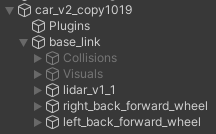

# Unity Car 2 Wheels

This project uses Unity version 2022.3.15f1.

The Scripts/ directory in Assets/ is a submodule whose source is from [alianlbj23](https://github.com/alianlbj23/Unity_script).


## Debug Environment

- .NET SDK 8.0


## Restore Scene

- After cloning the repository, navigate to `Assets/Scenes/` in Unity and double-click the scene file. e.g. `SampleScene`


## Steps

### URDF Importer

Reference: https://github.com/Unity-Technologies/URDF-Importer

1. Open the Package Manager from the Unity Menu. Click `Window -> Package Manager`. A new package manager window will appear.

2. Click on the `+` sign on the top left corner of the package manager window and click on `Add Package from Git URL`.
3. Enter the git URL for the URDF Importer with the latest version tag (currently v0.5.2) `https://github.com/Unity-Technologies/URDF-Importer.git?path=/com.unity.robotics.urdf-importer#v0.5.2` in the text box and press `Enter`.
4. Click `Import URDF`.


### ROS TCP Connector

Reference: https://github.com/Unity-Technologies/ROS-TCP-Connector

1. Open the Package Manager from the Unity Menu. Click `Window -> Package Manager`. A new package manager window will appear.
2. Click on the `+` sign on the top left corner of the package manager window and click on `Add Package from Git URL`.
3. Enter the git URL for the URDF Importer with the latest version tag (currently v0.5.2) `https://github.com/Unity-Technologies/ROS-TCP-Connector.git?path=/com.unity.robotics.ros-tcp-connector` in the text box and press `Enter`.


### NuGet for Unity

Reference: https://github.com/GlitchEnzo/NuGetForUnity

1. Open Package Manager window (Window | Package Manager)
2. Click the `+` button on the upper-left of a window, and select "Add package from git URL..."
3. Enter the following URL and click the `Add` button

```
https://github.com/GlitchEnzo/NuGetForUnity.git?path=/src/NuGetForUnity
```

4. At this point, you'll see NuGet in the Unity Menu. If doesn't, restart the Unity.


> ***NOTE:\*** To install a concrete version, specify the version by prepending #v{version} e.g. `#v2.0.0`. For more see [Unity UPM Documentation](https://docs.unity3d.com/Manual/upm-git.html).


### WebSocket Sharp - Net Standard

1. Open the NuGet from the Unity Menu. Click `Nuget -> Manage NuGet Packages`. A new NuGet for Unity window will appear.
2. Search the package `websocketsharp-netstanderd` and then install it.


### Newtonsoft.json

Reference: https://www.nuget.org/packages/Newtonsoft.Json/

1. Open the NuGet from the Unity Menu. Click `Nuget -> Manage NuGet Packages`. A new NuGet for Unity window will appear.
2. Search the package `Newtonsoft.json` and then install it.


### Slam

You have to modify the URDF file to add the `base_footprint` link at the appropriate part.

```xml
	...
</gazebo>

<link name="base_footprint" />
<joint name="base_joint" type="fixed">
    <parent link="base_footprint" />
    <child link="base_link" />
    <origin rpy="0 0 0" xyz="0 0 0.010" />
</joint>

<link name="base_link">
    ...
```


### Import Your Car Model from URDF

#### Structure of the URDF

```bash
.
├── car_v2_copy1019_description
│   ├── meshes
│   │   ├── base_link.prefab
│   │   ├── base_link.stl
│   │   ├── base_link_0.asset
│   │   ├── base_link_1.asset
│   │   ├── ...
│   │   ├── base_link_23.asset
│   │   ├── c2_v1_1.prefab
│   │   ├── c2_v1_1.stl
│   │   ├── c2_v1_1_0.asset
│   │   ├── c2_v1_1_1.asset
│   │   ├── c2_v1__1__1.prefab
│   │   ├── c2_v1__1__1.stl
│   │   ├── c2_v1__1__1_0.asset
│   │   ├── c2_v1__1__1_1.asset
│   │   ├── lidar_v1_1.prefab
│   │   ├── lidar_v1_1.stl
│   │   ├── lidar_v1_1_0.asset
│   │   ├── lidar_v1_1_1.asset
│   └── meshes.meta
├── test_abb_4600.urdf
```

We show the part of the URDF file `test_abb_4600.urdf`.

```xml
...
<link name="base_link">
    <inertial>
      <origin xyz="-0.033614332957262155 -0.004539784516663659 0.05035636914443814" rpy="0 0 0"/>
      <mass value="10.997959919526476"/>
      <inertia ixx="0.068393" iyy="0.12963" izz="0.139744" ixy="1.4e-05" iyz="-4e-06" ixz="-0.00959"/>
    </inertial>
    <visual>
      <origin xyz="0 0 0" rpy="0 0 0"/>
      <geometry>
        <mesh filename="package://car_v2_copy1019_description/meshes/base_link.stl" scale="0.001 0.001 0.001"/>
      </geometry>
      <material name="silver"/>
    </visual>
    ...
</link>
...
```

Pay some attention to the mesh tag. It specifies the locations of the packages. Hence, you must put the corresponding mesh .stl files like the above structure.


### Rename the wheels and lidar in Unity



> base_scan
>
> right_back_forward_wheel
>
> left_back_forward_wheel


### (2 Wheels Car Model Only) Create a Sphere in the Front of the Car

Create a sphere at the location of the structure shown above.


### Add Articulation Body in base_footprint

1. Click on the `base_footprint` component.
2. Click the `Add Component` in the Inspector, search for the `Articulation Body` and add it.


### Lidar Script

1. Click on the `base_scan` component.
2. Add the `LidarSensor.cs` component to the `base_scan`.


### Robot Script

1. Click on your car model name. In the case shown above, click `car_v2_copy1019`.
2. Toggle (Uncheck) the Controller Script shown in the Inspector in Unity.
3. Add the `Robot.cs` component to this car model object.


### Setup Lidar

1. Click on your car model name. In the case shown above, click `car_v2_copy1019`.
2. Add `base_scan` component into `Lidar` field in `Robot.cs` script in the Inspector in Unity.


### Motor Move Forward (Maybe doesn't need?)

1. Click on your wheels.
2. Add `MotorMoveForward.cs` into your wheel components.


### Create Target

1. Create a 3D object and rename it to `Target`
2. In the inspector field, scale the object size to 0.1.
3. Move the target to the appropriate location by moving the axes.


### Create Wall, Floor, and Move to Proper Location

Just create the 3D objects.

頑張って


### Create Anchors

1. Create the empty objects
2. Put them into the corners of the wall and assign them to either clockwise or counterclockwise order.
3. Put them into the `TrainingManager.cs` script in the `TrainingManager` Unity object.


### Training Manager

1. Create a new empty Unity object and rename it to `TrainingManager`
2. Add the `TrainingManager.cs` component to this object.
3. Add the Target into the `Target` field in `TrainingManager.cs` script in the Inspector in Unity.


# Note

- The [submodule](https://github.com/alianlbj23/Unity_script) is set to the main branch because the codes in the develop branch have bugs.
- Modify the `MotionSensor` class in `MotionSensor.cs`

```c#
public class MotionSensor : MonoBehaviour
{
    ...
}
```

- Since we've added a `base_footprint` in our URDF car model, the `TrainManager.cs` have to match this structure.

```c#
void Start()
{
    base_footprint = robot.transform.Find("base_footprint");
    baselink = base_footprint.transform.Find("base_link");
    if (baselink == null)
    {
        Debug.Log("Testing");
    }
...
}
```

- There are still many scripts in `TrainingManager.cs` like `Target`, `Obstacle 1`, ..., etc. You have to create empty objects and put them into these scripts. We've created and put them into the `Unneed` object.

