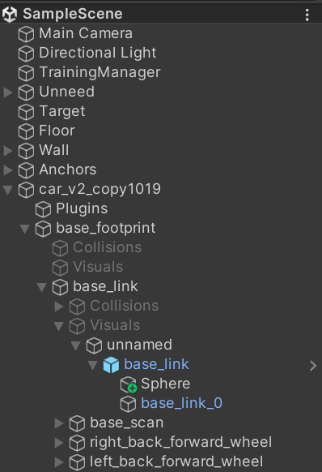

# Unity Car 2 Wheels

This project uses Unity version 2022.3.15f1.

The Scripts/ directory in Assets/ is a submodule whose source is from [alianlbj23](https://github.com/alianlbj23/Unity_script).


## Debug Environment

- .NET SDK 8.0


## Steps

### URDF Importer

Reference: https://github.com/Unity-Technologies/URDF-Importer

1. Open the Package Manager from the Unity Menu. Click `Window -> Package Manager`. A new package manager window will appear.

2. Click on the `+` sign on the top left corner of the package manager window and click on `Add Package from Git URL`.
3. Enter the git URL for the URDF Importer with the latest version tag (currently v0.5.2) `https://github.com/Unity-Technologies/URDF-Importer.git?path=/com.unity.robotics.urdf-importer#v0.5.2` in the text box and press `Enter`.
4. Click `Import URDF`.


### ROS TCP Connector

Reference: https://github.com/Unity-Technologies/ROS-TCP-Connector

1. Open the Package Manager from the Unity Menu. Click `Window -> Package Manager`. A new package manager window will appear.
2. Click on the `+` sign on the top left corner of the package manager window and click on `Add Package from Git URL`.
3. Enter the git URL for the URDF Importer with the latest version tag (currently v0.5.2) `https://github.com/Unity-Technologies/ROS-TCP-Connector.git?path=/com.unity.robotics.ros-tcp-connector` in the text box and press `Enter`.


### NuGet for Unity

Reference: https://github.com/GlitchEnzo/NuGetForUnity

1. Open Package Manager window (Window | Package Manager)
2. Click the `+` button on the upper-left of a window, and select "Add package from git URL..."
3. Enter the following URL and click the `Add` button

```
https://github.com/GlitchEnzo/NuGetForUnity.git?path=/src/NuGetForUnity
```

4. At this point, you'll see NuGet in the Unity Menu. If doesn't, restart the Unity.


> ***NOTE:\*** To install a concrete version, specify the version by prepending #v{version} e.g. `#v2.0.0`. For more see [Unity UPM Documentation](https://docs.unity3d.com/Manual/upm-git.html).


### WebSocket Sharp - Net Standard

1. Open the NuGet from the Unity Menu. Click `Nuget -> Manage NuGet Packages`. A new NuGet for Unity window will appear.
2. Search the package `websocketsharp-netstanderd` and then install it.


### Newtonsoft.json

Reference: https://www.nuget.org/packages/Newtonsoft.Json/

1. Open the NuGet from the Unity Menu. Click `Nuget -> Manage NuGet Packages`. A new NuGet for Unity window will appear.
2. Search the package `Newtonsoft.json` and then install it.


### Import Your Car Model from URDF

#### Structure of the URDF

```bash
.
├── car_v2_copy1019_description
│   ├── meshes
│   │   ├── base_link.prefab
│   │   ├── base_link.stl
│   │   ├── base_link_0.asset
│   │   ├── base_link_1.asset
│   │   ├── ...
│   │   ├── base_link_23.asset
│   │   ├── c2_v1_1.prefab
│   │   ├── c2_v1_1.stl
│   │   ├── c2_v1_1_0.asset
│   │   ├── c2_v1_1_1.asset
│   │   ├── c2_v1__1__1.prefab
│   │   ├── c2_v1__1__1.stl
│   │   ├── c2_v1__1__1_0.asset
│   │   ├── c2_v1__1__1_1.asset
│   │   ├── lidar_v1_1.prefab
│   │   ├── lidar_v1_1.stl
│   │   ├── lidar_v1_1_0.asset
│   │   ├── lidar_v1_1_1.asset
│   └── meshes.meta
├── test_abb_4600.urdf
```

We show the part of the URDF file `test_abb_4600.urdf`.

```xml
...
<link name="base_link">
    <inertial>
      <origin xyz="-0.033614332957262155 -0.004539784516663659 0.05035636914443814" rpy="0 0 0"/>
      <mass value="10.997959919526476"/>
      <inertia ixx="0.068393" iyy="0.12963" izz="0.139744" ixy="1.4e-05" iyz="-4e-06" ixz="-0.00959"/>
    </inertial>
    <visual>
      <origin xyz="0 0 0" rpy="0 0 0"/>
      <geometry>
        <mesh filename="package://car_v2_copy1019_description/meshes/base_link.stl" scale="0.001 0.001 0.001"/>
      </geometry>
      <material name="silver"/>
    </visual>
    ...
</link>
...
```

Pay some attention to the mesh tag. It specifies the locations of the packages. Hence, you must put the corresponding mesh .stl files like the above structure.


### Rename the wheels in Unity




# Note

- The [submodule](https://github.com/alianlbj23/Unity_script) is set to the main branch because the codes in the develop branch have bugs.
